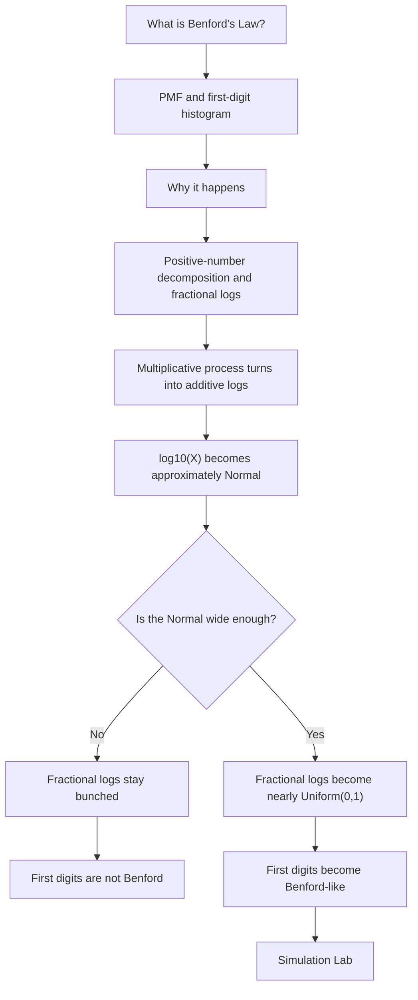

# Benford Emergence Mini App

## Problem Frame

Users often hear that Benford's Law appears in naturally occurring numbers, but the usual explanation skips both the basic definition and the key emergence condition. The app should first make the law concrete as a first-digit probability distribution, then explain why it can arise, then let users experiment with when Benford behavior appears, when it fails, and why wide distributions in log space make the difference.

The primary teaching frame is **Benford emergence from wide log distributions**, not scale invariance. Unit conversion can appear as a supporting diagnostic, but it should not drive the narrative.

## Requirements

**What Is Benford's Law? Tab**
- R1. Provide a first tab titled "What is Benford's Law?" that defines Benford's Law as a probability mass function over first digits `1` through `9`.
- R2. Show the PMF explicitly as `P(D = d) = log10(1 + 1 / d)` for `d = 1, ..., 9`.
- R3. Show a Benford first-digit histogram or bar chart with digit `1` near `30.1%`, digit `2` near `17.6%`, and decreasing probabilities through digit `9`.
- R4. Include a worked calculation for `P(D = 1)`: `P(D = 1) = log10(2) - log10(1) = log10(2) ~= 0.301`.
- R5. Pair the PMF with a plain-language interpretation: under Benford's Law, first digit `1` is much more common than first digit `9`; the distribution is not uniform over digits.
- R6. Include a small example histogram or comparison that contrasts a uniform first-digit intuition with Benford's decreasing first-digit shape.
- R7. Include real-world scenario examples where Benford-like first digits are often encountered, such as populations, river lengths, financial transaction amounts, accounting line items, scientific constants or measurements across scales, city sizes, and market or economic quantities. Present these as contexts where Benford may appear when the data span orders of magnitude, not as guaranteed cases.
- R8. Include a short caveat in this tab that Benford's Law is not expected for assigned identifiers, bounded ranges, prices shaped by policy, rounded or thresholded data, or datasets that do not span enough scale.

**Why It Happens Tab**
- R9. Provide a second tab titled "Why it Happens" that is math-first and follows the line of argument in `docs/Understanding Benford's Law.md`.
- R10. Start with a basic/prerequisite section covering positive values, powers of ten, scientific notation, first digit/significand intuition, base-10 logs, and fractional parts. Keep it concise and visual so the later derivation is approachable.
- R11. Start the main walkthrough from the decomposition for positive values: `X = 10^K * M`, where `K` is an integer and `1 <= M < 10`. Use this to show that `log10(X) = K + log10(M)`.
- R12. Show that `log10(M)` lies in `[0, 1)` and is exactly the fractional part `{log10(X)}`. Use an example like `3140 = 10^3 * 3.14` and `log10(3140) ~= 3 + log10(3.14) = 3.497`.
- R13. Explain that the first digit is `j` when `j <= M < j + 1`, equivalently `log10(j) <= log10(M) < log10(j + 1)`.
- R14. Derive the Benford probability from the uniform fractional-log assumption: if `{log10(X)}` is uniform on `[0, 1)`, then `P(D = j) = log10(j + 1) - log10(j) = log10((j + 1) / j)`.
- R15. Visualize first-digit intervals on the fractional log scale from `0` to `1`, including that digit `1` occupies `[0, log10(2))` and therefore has probability about `30.1%` when fractional logs are uniform.
- R16. Explain the multiplicative-to-additive transformation: `X = A1 A2 ... An` becomes `log10(X) = log10(A1) + ... + log10(An)`, making the connection to approximately Normal logs through the CLT.
- R17. Explicitly teach the missing step: Benford requires fractional logs `{log10(X)}` to be approximately uniform, not merely that `log10(X)` is approximately Normal.
- R18. Teach the wrapped-density idea for `Z = log10(X)`: for `0 <= r < 1`, the density of `{Z}` is the sum of Normal-density contributions at `r`, `1 + r`, `2 + r`, and so on, expressed conceptually as `f_{ {Z} }(r) = sum_k f_Z(k + r)`.
- R19. Contrast a narrow Normal, such as `Z ~ N(3.2, 0.01)`, whose fractional parts stay bunched near `0.2`, with a wide Normal, such as `Z ~ N(3.2, 100)`, whose mass spans many unit intervals that fold onto `[0, 1)`.
- R20. Explain why the wrapped wide Normal becomes nearly flat: when the Normal changes slowly over a distance of `1`, the sums at fractional positions like `0.2` and `0.7` are nearly the same.
- R21. Include a side-by-side or stepwise visual showing a narrow Normal log distribution with bunched fractional logs, a wider Normal with more even fractional logs, and the resulting first-digit distribution becoming more Benford-like.
- R22. End the tab with the takeaway that Benford appears when values are spread broadly enough across logarithmic scale for fractional logs to become nearly uniform.
- R23. Frame "wide enough" as an approximate educational condition, not a deterministic threshold. The explainer should note that finite samples can still deviate from Benford even when the theoretical wrapped log distribution is close to uniform.

**Simulation Lab**
- R24. Provide a third tab titled "Simulations" where users can experiment with two first-version modes: direct lognormal simulation and multiplicative growth simulation.
- R25. In direct lognormal mode, let users control `mu`, `sigma`, and sample size for `Z ~ Normal(mu, sigma^2)` and `X = 10^Z`.
- R26. In multiplicative growth mode, each sample should start at `X0` and multiply by independent positive factors `Gt` where `log10(Gt) ~ Normal(growth_mean, growth_volatility^2)`. Let users control starting value, number of multiplicative steps, growth mean, growth volatility, and sample size.
- R27. The multiplicative growth mode should state its modeling assumptions: independent positive growth factors with finite variance, parameterized in log10 space. It should avoid implying that every multiplicative process becomes Benford-like.
- R28. For each simulation, show `log10(X)`, fractional logs `{log10(X)}`, and first-digit frequencies versus Benford probabilities.
- R29. Make the "wide Normal" effect discoverable: increasing `sigma`, multiplicative steps, or growth volatility should visibly flatten fractional logs and reduce distance from Benford.
- R30. Include one lightweight counterexample preset or note showing that high `SD(log10 X)` is not sufficient by itself if fractional logs remain structured rather than uniform.
- R31. Label sampled diagnostics as noisy estimates, include a way to rerun or reseed the simulation, and avoid presenting one random sample as proof of convergence.

**Diagnostics and Guidance**
- R32. Display `SD(log10 X)` as the primary numeric readiness signal, while treating the fractional-log histogram as the central visual diagnostic.
- R33. Use approximate log-width bands or labeled presets for narrow, transitional, and wide cases so the "why this sample is or is not Benford" explanation does not invent hidden thresholds.
- R34. Display a distance-from-Benford metric, such as absolute error sum or RMSE between simulated first-digit frequencies and Benford probabilities.
- R35. Treat the fractional-log histogram as the most direct diagnostic: if it is flat, first digits should be close to Benford; if it is bunched or patterned, they should not.
- R36. Provide a "why this sample is or is not Benford" explanation that interprets the current simulation in terms of log-width, fractional-log uniformity, sampling noise, and first-digit error.

**Experience**
- R37. Use a three-tab interactive structure: "What is Benford's Law?", "Why it Happens", and "Simulations".
- R38. Make the first tab definitional and example-led, the second tab conceptual and math-first, and the third tab experimental.
- R39. Structure the "Why it Happens" tab as a linear learning sequence: prerequisites, positive-number decomposition, log split, first-digit intervals, Benford probability derivation, products-to-sums, wrapped-density intuition, narrow-versus-wide Normal contrast, and final takeaway.
- R40. Structure the lab around the fractional-log histogram and first-digit comparison as the primary charts, with controls grouped beside or above the charts depending on viewport width.
- R41. Provide a guided happy path through defaults or presets: start narrow, increase `sigma` or multiplicative width, observe fractional logs flatten, then compare first digits with Benford probabilities.
- R42. Keep the app usable without a backend; simulations should run locally in the browser.
- R43. Prioritize visual clarity over exhaustive statistical controls. The app should help users develop intuition, not behave like a full statistics package.
- R44. Make default settings produce a useful contrast between non-Benford and Benford-like outcomes without requiring users to tune every control first.
- R45. Define responsive and accessibility expectations during planning: charts must remain readable on small screens, controls must be keyboard and touch usable, color should not be the only encoding, and chart text or summaries should explain the same conclusion shown visually.
- R46. Render mathematical notation with LaTeX-quality typography rather than plain code text. Formula rendering should support both display math and inline math, remain readable on mobile, and provide accessible text where the visual notation alone would be ambiguous.

## Success Criteria

- A user can state Benford's PMF for first digits and explain why `P(D = 1)` is about `30.1%`.
- A user can recognize the characteristic decreasing Benford histogram and distinguish it from a uniform first-digit distribution.
- A user can name realistic contexts where Benford-like behavior may appear, while understanding that these examples still require scale, domain, and data-quality checks.
- A user can explain that first digits are determined by the fractional part of `log10(X)`.
- A user can see that a Normal distribution in log space is not sufficient by itself; the log distribution must be wide enough for fractional logs to become nearly uniform.
- A user can make Benford-like behavior appear by increasing lognormal `sigma` or by increasing multiplicative steps or volatility.
- A user can make the app show non-Benford behavior with narrow log distributions.
- Given a new simulated or described dataset, a user can predict whether Benford-like first digits should appear by checking log-width and fractional-log uniformity, rather than relying on whether the data sounds natural or lognormal.
- The first-digit chart, fractional-log histogram, and log-width metric tell a coherent story in the provided default and preset scenarios, with sampling noise called out when it affects the visual result.

## Scope Boundaries

- Do not present scale invariance as the central teaching frame.
- Do not build a backend, persistence, accounts, data upload, or sharing workflow for the first version.
- Do not try to prove a theorem rigorously; use correct math, but optimize for intuition and interaction.
- Do not include every possible data-generating process. Direct lognormal and multiplicative growth are the core simulations.
- Do not require external datasets for the initial app.
- Do not imply that every listed real-world scenario always follows Benford's Law; the examples should be framed as common contexts, not guarantees.
- Do not include additive-versus-multiplicative comparison or unit conversion in the first version unless the core emergence loop is already complete and these additions do not dilute the main learning goal.
- Do not leave core formulas as plain monospace strings once LaTeX rendering is available; code-like styling is acceptable only for literal variable names in prose or fallback accessible labels.

## Key Decisions

- Three-tab learning path: separate "what", "why", and "try it" so users first understand the distribution before seeing the emergence mechanism. This reduces cognitive load without changing the core teaching frame.
- LaTeX formula rendering: the app is math-first, so formulas should look like mathematical notation rather than code snippets. This improves readability for PMFs, logarithms, fractional parts, and wrapped-density expressions.
- Primary frame: Benford emergence from wide log distributions. This matches the desired learning goal better than a scale-invariance-first framing.
- Core simulations: direct lognormal and multiplicative growth. Together they show both the condition for Benford and where that condition can come from.
- Diagnostic hierarchy: `SD(log10 X)` is the primary numeric readiness signal, but fractional logs `{log10(X)}` are the central visual diagnostic. This avoids replacing the scale-invariance misconception with an SD-only misconception.
- First-version scope: additive comparison and unit conversion are deferred. They are useful context, but emphasizing them early would distract from the wide-Normal learning goal.

## Dependencies / Assumptions

- The repository now contains an initial React/Vite app implementing the earlier two-tab version; this requirements update should drive the next revision rather than a net-new app.
- The implementation workflow should follow the repo instruction to use red-green test-driven development when writing code.
- A lightweight browser app is sufficient for the first version.

## Outstanding Questions

### Resolve Before Planning

- None.

### Deferred to Planning

- [Affects R3-R6][Design] Choose whether the first tab's PMF visualization should reuse the existing first-digit chart component or present a separate static PMF-focused chart.
- [Affects R7-R8][Content] Choose the exact real-world examples and caveat wording so the app is useful without sounding like Benford applies automatically.
- [Affects R33][Technical] Choose the approximate log-width bands or presets for narrow, transitional, and wide cases.
- [Affects R34][Technical] Choose the exact distance-from-Benford metric and visual labeling.
- [Affects R41][Design] Choose the specific default narrow and wide scenarios used in the guided happy path.
- [Affects R25-R26][Design / Technical] Define numeric input bounds, reset behavior, and whether simulations update live, on debounce, or through an explicit run button.
- [Affects R31][Technical] Decide whether to use random reruns, seed controls, or both for explaining sampling noise.
- [Affects R45][Design] Define responsive chart stacking, keyboard navigation, and accessible chart summaries.
- [Affects R46][Technical / Design] Choose the LaTeX rendering package and accessibility pattern for formulas.
- [Deferred enhancement] Consider additive-versus-multiplicative comparison only after the core direct-lognormal and multiplicative-growth loop is complete, and word it narrowly as a comparison against simple additive increments around a fixed scale.
- [Deferred enhancement] Consider a simple unit-conversion diagnostic only after the core emergence loop is polished, and only if it does not shift the teaching frame toward scale invariance.

## Next Steps

-> `/ce:plan` for structured implementation planning.
