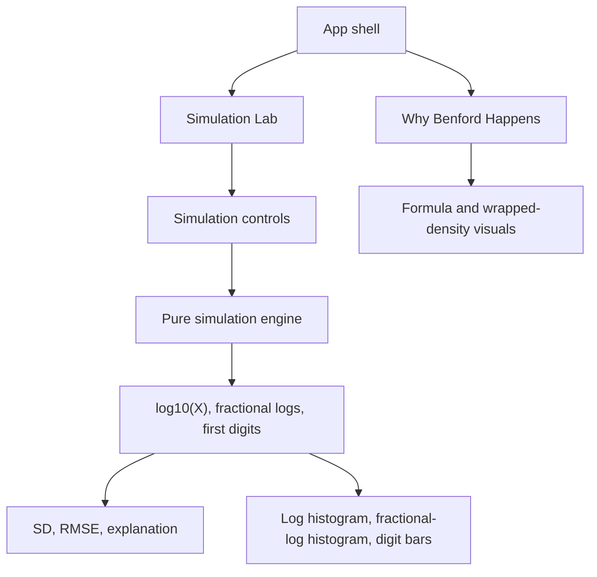

# feat: Build Benford emergence applet

## Overview

Build a static, browser-only React applet that teaches when Benford's Law emerges and when it does not. The app will use a two-page structure: a math-first explainer and an interactive simulation lab. The core teaching path is that multiplicative processes can make `log10(X)` approximately Normal, but Benford-like first digits appear only when fractional logs `{log10(X)}` become nearly uniform (see origin: `docs/brainstorms/2026-05-09-benford-emergence-mini-app-requirements.md`).

The implementation should be test-first where behavior is feature-bearing: write failing tests for math utilities, simulation outputs, diagnostics, and key UI behavior before implementing those units.

## Problem Frame

Common Benford explanations jump from "natural numbers" or "lognormal-looking data" to first-digit frequencies without showing the load-bearing condition. This app should make the missing step visible: a Normal distribution in log space is not sufficient by itself; the Normal must be wide enough that wrapping modulo `1` makes fractional logs nearly uniform.

## Requirements Trace

- R1-R15. The explainer must follow the origin document's mathematical sequence: positive-number decomposition, fractional logs, first-digit intervals, Benford probability derivation, CLT, wrapped-density intuition, narrow-versus-wide Normal contrast, and caveats.
- R16-R23. The lab must include direct lognormal and multiplicative-growth modes, charts for logs/fractional logs/first digits, a counterexample note or preset, and sampling-noise handling.
- R24-R28. Diagnostics must include `SD(log10 X)`, distance from Benford, fractional-log uniformity, and explanatory text.
- R29-R36. The app must be a two-page browser app, responsive and accessible enough for chart-heavy learning, with defaults that contrast non-Benford and Benford-like behavior.
- Success criteria. Users should be able to predict Benford-like behavior from log-width and fractional-log uniformity rather than relying on whether data sounds natural or lognormal.

## Scope Boundaries

- No backend, persistence, account system, data upload, external datasets, or sharing workflow.
- No rigorous theorem-proving interface; math should be correct but optimized for intuition.
- No additive-versus-multiplicative comparison in V1.
- No unit-conversion diagnostic in V1.
- No serverless functions or SSR; deploy as a static app.

### Deferred to Separate Tasks

- Additive comparison: consider only after the core two simulations are polished.
- Unit conversion: consider later only if it does not shift the teaching frame toward scale invariance.
- Real dataset examples or uploads: intentionally out of scope for the first applet.

## Context & Research

### Relevant Code and Patterns

- The repository is effectively greenfield. Existing local artifact: `docs/brainstorms/2026-05-09-benford-emergence-mini-app-requirements.md`.
- No existing package, app shell, design system, test setup, or deployment configuration exists to follow.
- Session-provided repo instruction requires red-green test-driven development when implementing code.

### Institutional Learnings

- No `docs/solutions/` learnings are present in this repo.

### External References

- Vite static deployment docs say Vercel detects Vite projects and configures deployments automatically; Vite also documents Git-based preview and production deployments for Vercel and other static hosts.
- Vercel's Vite docs note that Vite SPA deep links need a `vercel.json` rewrite to `index.html`; this app should avoid route-specific deep links unless that rewrite is included.
- Recharts `ResponsiveContainer` adapts chart dimensions to its parent and relies on `ResizeObserver`; chart wrappers need explicit stable dimensions.
- Vitest supports Vite config reuse, TypeScript/JSX, jsdom or happy-dom DOM mocking, and browser-mode options. Use jsdom-style component tests first unless implementation reveals a need for browser-mode coverage.

## Key Technical Decisions

- Use Vite + React + TypeScript: low setup cost for a static interactive app, aligns with browser-only requirements, and deploys cleanly to Vercel.
- Use Recharts for charts: enough for histograms and bar comparisons without building custom SVG charting from scratch.
- Keep simulation logic in pure TypeScript modules: math, sampling, histograms, diagnostics, and explanatory rules should be testable without rendering React.
- Use deterministic seeded simulation support: sampling noise is part of the teaching story, so users need rerun or seed behavior and tests need reproducible outputs.
- Use plain CSS in `src/styles/global.css` rather than a large design framework: the app needs a focused math-lab interface, not a broad component system.
- Deploy as static output on Vercel first: Vite and Vercel support automatic static deployment and preview URLs; avoid backend features that would change cost/risk.

## Open Questions

### Resolved During Planning

- Log-width bands: use educational labels, not formal thresholds. Initial guidance: narrow around `SD(log10 X) < 0.25`, transitional around `0.25-0.6`, and wide around `> 0.6`, with copy stating that fractional-log shape is the direct diagnostic.
- Distance metric: use RMSE by default because it is compact and easy to label; optionally include the absolute-error sum later if needed.
- Simulation update model: use a hybrid model. Lightweight parameter edits update debounced; include an explicit rerun/reseed control so sampling noise is visible.
- Default scenarios: include a narrow direct lognormal preset, a wide direct lognormal preset, and a multiplicative-growth preset that widens with steps/volatility.
- Deployment target: Vercel static deployment for first launch, with no functions.

### Deferred to Implementation

- Exact component names and CSS class structure: decide while implementing.
- Exact copy length for the explainer: refine during UI implementation to fit responsive layouts.
- Final chart bin counts: start with plan defaults, then adjust if labels or mobile layout become cramped.
- Whether to add a Playwright smoke test: decide after the app shell exists and visual complexity is clear.

## Output Structure

    docs/
      brainstorms/
      plans/
    public/
    src/
      app/
      components/
      lib/
      styles/
      test/
    index.html
    package.json
    tsconfig.json
    vite.config.ts
    vercel.json

## High-Level Technical Design

> *This illustrates the intended approach and is directional guidance for review, not implementation specification. The implementing agent should treat it as context, not code to reproduce.*



## Implementation Units

- [x] **Unit 1: Scaffold Static React App**

**Goal:** Establish the Vite React TypeScript app, test harness, static deployment shape, and base file organization.

**Requirements:** R29, R33, scope boundaries

**Dependencies:** None

**Files:**
- Create: `package.json`
- Create: `index.html`
- Create: `vite.config.ts`
- Create: `tsconfig.json`
- Create: `vercel.json`
- Create: `src/main.tsx`
- Create: `src/app/App.tsx`
- Create: `src/styles/global.css`
- Create: `src/test/setup.ts`
- Test: `src/app/App.test.tsx`

**Approach:**
- Configure Vite for React and TypeScript.
- Configure Vitest with a DOM test environment and shared setup.
- Keep routing simple: internal tab/page state is enough for two pages. If URL routes are added, keep the `vercel.json` SPA rewrite.
- Add static deployment config only for SPA fallback and compatibility; no functions.

**Execution note:** Create a failing smoke test that renders the app shell and both page navigation labels before implementing the shell.

**Patterns to follow:**
- Origin document scope: static browser-only app, no backend.
- Vite and Vercel docs for static Vite deployment.

**Test scenarios:**
- Happy path: rendering the app shows the title and the two primary navigation options.
- Happy path: selecting each page changes visible content without reloading.
- Integration: static app shell works without requiring network calls or environment variables.

**Verification:**
- The app can build as static output.
- Test harness runs component tests.
- Vercel config contains no serverless function assumptions.

- [x] **Unit 2: Implement Benford Math and Simulation Core**

**Goal:** Create pure utilities for decomposition, fractional logs, first digits, Benford probabilities, seeded random sampling, direct lognormal simulation, multiplicative-growth simulation, histograms, and diagnostics.

**Requirements:** R2-R8, R16-R28

**Dependencies:** Unit 1

**Files:**
- Create: `src/lib/benford.ts`
- Create: `src/lib/random.ts`
- Create: `src/lib/simulation.ts`
- Create: `src/lib/histograms.ts`
- Create: `src/lib/diagnostics.ts`
- Test: `src/lib/benford.test.ts`
- Test: `src/lib/random.test.ts`
- Test: `src/lib/simulation.test.ts`
- Test: `src/lib/histograms.test.ts`
- Test: `src/lib/diagnostics.test.ts`

**Approach:**
- Keep all numeric operations in log space where possible to avoid overflow in multiplicative simulations.
- Model direct lognormal as sampled `Z`, then derive `X = 10^Z` only for display-scale values when safe.
- Model multiplicative growth as additive Normal increments in `log10` space, matching the origin requirement for positive independent growth factors.
- Use a small seeded PRNG so tests and reruns can reproduce samples.
- Compute first digits from `Z` through fractional logs/significand rather than relying on potentially huge `X` values.
- Use RMSE between observed digit frequencies and Benford probabilities as the default distance metric.

**Execution note:** Implement all pure math behavior test-first. Start with known deterministic examples from the origin document, then add simulation and diagnostic tests.

**Technical design:** Directional data flow:

```text
SimulationConfig -> logSamples -> fractionalLogs -> firstDigits
               -> histograms -> diagnostics -> explanation inputs
```

**Patterns to follow:**
- Mathematical argument in `docs/brainstorms/2026-05-09-benford-emergence-mini-app-requirements.md`.

**Test scenarios:**
- Happy path: `3140` decomposes to order `3`, significand about `3.14`, and fractional log about `0.497`.
- Happy path: Benford probabilities for digits `1-9` sum to approximately `1`, and digit `1` is about `0.301`.
- Happy path: first digit extraction handles values across magnitudes, including values less than `1`.
- Edge case: zero, negative, `NaN`, and infinite values are rejected or handled explicitly according to utility contract.
- Happy path: direct lognormal simulation with the same seed returns stable log samples.
- Happy path: multiplicative simulation increases `SD(log10 X)` when steps or volatility increase, holding seed/sample size constant.
- Edge case: histogram bins include boundary values without losing samples at `0` or values near `1`.
- Integration: diagnostics from a narrow preset report bunched fractional logs and higher Benford distance than a wide preset with the same sample size.

**Verification:**
- Pure utility tests cover deterministic math and seeded stochastic behavior.
- Simulation output never depends on unsafe large products for core calculations.

- [x] **Unit 3: Build Explainer Page**

**Goal:** Implement the math-first "Why Benford Happens" page using the origin document's line of argument and visual sequence.

**Requirements:** R1-R15, R30, success criteria

**Dependencies:** Unit 1, Unit 2 for shared probability helpers

**Files:**
- Create: `src/components/ExplainerPage.tsx`
- Create: `src/components/FormulaBlock.tsx`
- Create: `src/components/LogIntervalStrip.tsx`
- Create: `src/components/WrappedNormalVisual.tsx`
- Modify: `src/app/App.tsx`
- Modify: `src/styles/global.css`
- Test: `src/components/ExplainerPage.test.tsx`
- Test: `src/components/LogIntervalStrip.test.tsx`

**Approach:**
- Present the explainer as a linear sequence: decomposition, log split, first-digit intervals, Benford probability derivation, CLT, wrapped-density intuition, narrow-vs-wide contrast, caveats.
- Make the first-digit interval strip the most important static visual on the page.
- Make wrapped-density visuals conceptual and readable rather than theorem-heavy.
- Include the real-world caveat without turning the page into a fraud-detection guide.

**Execution note:** Add tests for the presence and order of the mathematical sections before implementing page content.

**Patterns to follow:**
- Origin document R2-R15.
- Frontend design guidance: avoid generic marketing sections; first screen should be the useful explainer, not a landing page.

**Test scenarios:**
- Happy path: the explainer displays the positive-number decomposition before the first-digit interval derivation.
- Happy path: the interval strip includes all digits `1-9` and shows digit `1` as the largest interval.
- Happy path: the wrapped Normal section explicitly contrasts narrow and wide Normal cases.
- Accessibility: formula-heavy visuals have adjacent text summaries conveying the same conclusion.
- Responsive: explainer sections remain in reading order when stacked on narrow screens.

**Verification:**
- The page teaches the exact mathematical chain from the origin document.
- The visual hierarchy emphasizes fractional logs and first-digit intervals.

- [x] **Unit 4: Build Simulation Lab Controls and State**

**Goal:** Implement lab mode selection, parameter controls, presets, seeded reruns, debounced updates, and explanation state.

**Requirements:** R16-R19, R21-R23, R25, R28, R32, R35

**Dependencies:** Unit 2

**Files:**
- Create: `src/components/SimulationLab.tsx`
- Create: `src/components/SimulationControls.tsx`
- Create: `src/components/PresetSelector.tsx`
- Create: `src/components/DiagnosticSummary.tsx`
- Create: `src/lib/presets.ts`
- Modify: `src/app/App.tsx`
- Test: `src/components/SimulationLab.test.tsx`
- Test: `src/components/SimulationControls.test.tsx`
- Test: `src/lib/presets.test.ts`

**Approach:**
- Offer two modes only: direct lognormal and multiplicative growth.
- Provide presets for narrow, transitional, wide, and multiplicative-growth cases.
- Use bounded numeric controls to avoid unusable sample sizes or unreadable charts.
- Use debounced parameter updates plus explicit rerun/reseed controls.
- Make explanation text derive from diagnostics, not from hardcoded mode labels.

**Execution note:** Start with tests for mode defaults, preset application, and rerun/seed behavior.

**Patterns to follow:**
- Origin document deferred decisions resolved in this plan.

**Test scenarios:**
- Happy path: selecting the narrow direct lognormal preset sets low `sigma` and produces a non-Benford explanation.
- Happy path: selecting the wide direct lognormal preset sets higher `sigma` and produces a more Benford-like explanation.
- Happy path: multiplicative mode exposes starting value, steps, growth mean, volatility, and sample size.
- Edge case: invalid numeric inputs are clamped or rejected without crashing the lab.
- Edge case: very small sample sizes trigger sampling-noise language.
- Integration: changing a control updates diagnostics and explanation after the debounce interval or explicit rerun.
- Integration: rerun changes sampled estimates while keeping parameters; fixed seed reproduces the same sample.

**Verification:**
- Users can reproduce the guided happy path without manually configuring every parameter.
- No optional additive or unit-conversion controls appear in V1.

- [x] **Unit 5: Build Charts and Diagnostic Views**

**Goal:** Render the lab charts and diagnostic summaries: log histogram, fractional-log histogram, first-digit frequencies versus Benford probabilities, RMSE, and log-width labels.

**Requirements:** R20-R28, R31, R36

**Dependencies:** Unit 2, Unit 4

**Files:**
- Create: `src/components/charts/LogHistogram.tsx`
- Create: `src/components/charts/FractionalLogHistogram.tsx`
- Create: `src/components/charts/FirstDigitChart.tsx`
- Create: `src/components/charts/ChartFrame.tsx`
- Modify: `src/components/SimulationLab.tsx`
- Modify: `src/styles/global.css`
- Test: `src/components/charts/FractionalLogHistogram.test.tsx`
- Test: `src/components/charts/FirstDigitChart.test.tsx`
- Test: `src/components/DiagnosticSummary.test.tsx`

**Approach:**
- Use Recharts for SVG charts inside stable, responsive chart containers.
- Treat the fractional-log histogram and first-digit comparison as primary charts.
- Keep log histogram useful but secondary; the teaching hinge is modulo-1 flattening.
- Show observed first-digit bars and Benford reference values in the same chart.
- Use labels and summaries so the chart conclusion is not color-only.

**Execution note:** Test chart data transformation and accessible summaries before styling.

**Patterns to follow:**
- Recharts `ResponsiveContainer` guidance: parent wrappers need stable dimensions.

**Test scenarios:**
- Happy path: first-digit chart receives nine observed digit entries and nine Benford reference values.
- Happy path: fractional-log histogram bins cover `[0, 1)` and preserve sample counts.
- Happy path: diagnostic summary labels narrow, transitional, and wide cases according to plan bands.
- Accessibility: each chart has a text summary that states the main interpretation.
- Responsive: chart containers retain stable dimensions and do not collapse when parent width changes.

**Verification:**
- Chart output and diagnostic copy agree for narrow and wide presets.
- The app remains readable on mobile-sized and desktop-sized layouts.

- [x] **Unit 6: Polish App Shell, Accessibility, and Deployment Readiness**

**Goal:** Finish responsive layout, keyboard behavior, page-level accessibility, final copy pass, deployment metadata, and static-host readiness.

**Requirements:** R29-R36, success criteria, scope boundaries

**Dependencies:** Units 3-5

**Files:**
- Modify: `src/app/App.tsx`
- Modify: `src/components/ExplainerPage.tsx`
- Modify: `src/components/SimulationLab.tsx`
- Modify: `src/styles/global.css`
- Modify: `index.html`
- Modify: `vercel.json`
- Create: `README.md`
- Test: `src/app/App.test.tsx`

**Approach:**
- Keep navigation simple and keyboard reachable.
- Use a restrained math-lab interface: dense enough for comparison, not a marketing page.
- Add page metadata and README deployment notes for Vercel static hosting.
- Confirm no backend-only assumptions, external API calls, or paid platform features are introduced.

**Execution note:** Add or update tests for keyboard navigation and accessible page labels before final layout polish.

**Patterns to follow:**
- Origin document scope boundaries.
- Vercel Vite static deployment docs.

**Test scenarios:**
- Happy path: keyboard users can switch between explainer and lab.
- Accessibility: top-level pages expose clear headings and chart summaries.
- Integration: app shell contains no network-dependent startup behavior.
- Deployment: static SPA fallback does not introduce serverless function configuration.

**Verification:**
- The app meets the origin success criteria with the default presets.
- Build artifacts are static and suitable for Vercel deployment.
- README explains local development, testing, build, and deployment at a high level.

## System-Wide Impact

- **Interaction graph:** User controls feed pure simulation utilities, which feed charts and diagnostic explanations. No external services or persistent state.
- **Error propagation:** Invalid inputs should be contained at the control layer and surfaced as inline control feedback or clamping, not as runtime errors.
- **State lifecycle risks:** Debounced updates and reruns can create stale chart/explanation mismatches; keep simulation output derived from a single committed state object.
- **API surface parity:** No public API surface. Pure utility contracts should remain internal but well-tested.
- **Integration coverage:** Component tests should verify that presets and control changes update charts and explanations together.
- **Unchanged invariants:** The app remains backend-free and static-deployable throughout V1.

## Risks & Dependencies

| Risk | Mitigation |
|------|------------|
| App teaches "large SD means Benford" too strongly | Keep fractional-log histogram central, include counterexample note/preset, and phrase SD as a readiness signal rather than proof. |
| Random samples visually contradict the explanation | Use sample-size controls, sampling-noise language, and rerun/seed behavior. |
| Numeric overflow from multiplicative products | Simulate and analyze in log10 space; derive display values cautiously. |
| Charts become unreadable on mobile | Use stable chart frames, responsive stacking, text summaries, and avoid overcrowded labels. |
| Scope creep from additive or unit conversion features | Keep them in deferred tasks and exclude controls from V1. |
| Vercel deployment accidentally gains server-side cost surface | Keep static Vite output, no functions, no SSR, no analytics/add-ons by default. |

## Documentation / Operational Notes

- `README.md` should describe the app purpose, local setup, test posture, static build, and Vercel deployment expectations.
- Deployment should use Vercel's static Vite detection with build output from Vite.
- The app should not require environment variables for V1.
- If URL routes are introduced later, keep SPA fallback configuration in `vercel.json`.

## Sources & References

- **Origin document:** [docs/brainstorms/2026-05-09-benford-emergence-mini-app-requirements.md](docs/brainstorms/2026-05-09-benford-emergence-mini-app-requirements.md)
- Vite static deployment: [https://vite.dev/guide/static-deploy.html](https://vite.dev/guide/static-deploy.html)
- Vercel Vite framework docs: [https://vercel.com/docs/frameworks/frontend/vite](https://vercel.com/docs/frameworks/frontend/vite)
- Recharts ResponsiveContainer docs: [https://recharts.github.io/en-US/api/ResponsiveContainer/](https://recharts.github.io/en-US/api/ResponsiveContainer/)
- Vitest features: [https://v3.vitest.dev/guide/features](https://v3.vitest.dev/guide/features)
