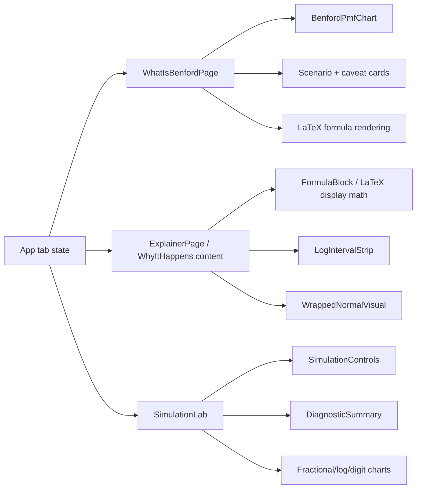

# feat: Add three-tab Benford learning flow

## Overview

Revise the existing Benford Emergence Lab from a two-tab app into a three-tab learning flow: "What is Benford's Law?", "Why it Happens", and "Simulations". The revision should introduce Benford's PMF and first-digit histogram before the mathematical mechanism, then preserve the current simulation lab as the experimental payoff.

## Problem Frame

The current app starts at the mechanism: why wide log distributions can make fractional logs nearly uniform. The updated requirements ask for a clearer pedagogical sequence: define the law first, show the PMF and a worked `P(D = 1)` calculation, then walk through the line of argument from `docs/Understanding Benford's Law.md`, and only then invite experimentation (see origin: `docs/brainstorms/2026-05-09-benford-emergence-mini-app-requirements.md`).

## Requirements Trace

- R1-R8. Add a first tab that defines Benford's Law, shows the PMF, renders a Benford histogram, calculates `P(D = 1)`, contrasts Benford against uniform digit intuition, and lists real-world contexts with caveats.
- R9-R23. Keep the second tab math-first, add a prerequisite section, and align the walkthrough with `docs/Understanding Benford's Law.md`: decomposition, fractional logs, digit intervals, CLT, wrapped density, and narrow-versus-wide Normal.
- R24-R31. Preserve the simulation lab as the third tab, with direct lognormal and multiplicative-growth modes, sampled diagnostics, and reseeding.
- R32-R36. Preserve diagnostics around `SD(log10 X)`, fractional-log uniformity, and distance from Benford.
- R37-R45. Implement the three-tab structure with responsive, accessible charts and keyboard-usable controls.
- R46. Render math with LaTeX-quality typography, including display and inline formulas, with readable mobile behavior and accessible labels.
- Success criteria. Users should be able to state Benford's PMF, explain why `P(D = 1)` is about `30.1%`, recognize the decreasing first-digit histogram, understand the fractional-log bridge, and make Benford-like behavior appear or fail in simulation.

## Scope Boundaries

- Do not present scale invariance as the central teaching frame.
- Do not add backend state, persistence, data upload, external datasets, accounts, or sharing.
- Do not add new simulation families beyond the existing direct lognormal and multiplicative-growth modes.
- Do not imply that all listed real-world examples are guaranteed Benford; examples must be framed as common contexts where Benford-like behavior may appear when data span orders of magnitude.
- Do not include additive-versus-multiplicative comparison or unit conversion in this revision.

## Context & Research

### Relevant Code and Patterns

- `src/app/App.tsx` currently owns the tab state and renders two pages. It should be extended to three page values rather than replaced with routing.
- `src/app/App.test.tsx` already tests tab rendering, click switching, and keyboard navigation. Extend those tests to include the new first tab.
- `src/components/ExplainerPage.tsx` already contains the current "Why Benford Happens" content and should become the second-tab content, with prerequisite copy added.
- `src/components/LogIntervalStrip.tsx`, `src/components/WrappedNormalVisual.tsx`, and `src/components/FormulaBlock.tsx` already cover the main visual/math patterns for the "Why" tab.
- `src/components/FormulaBlock.tsx` currently renders formula text in a code-style block. It should become the central wrapper for LaTeX display math, or be paired with a new formula-rendering component if that keeps the API cleaner.
- `src/components/SimulationLab.tsx` and `src/components/SimulationControls.tsx` already satisfy most simulation requirements. Keep this page focused and update title/copy only where needed for the new tab label.
- `src/components/charts/ChartFrame.tsx` and Recharts-based chart components establish the chart wrapper and accessible summary pattern to reuse for PMF visuals.
- `src/lib/benford.ts` already exposes `benfordProbability` and `benfordProbabilities`, which are enough for the PMF and static first-digit chart.
- `src/styles/global.css` contains the app shell, tab, explainer, lab, and responsive chart layout styles. Extend existing selectors rather than introducing a separate design system.
- `docs/Understanding Benford's Law.md` is the source for the second tab's mathematical line of argument.

### Institutional Learnings

- No `docs/solutions/` learnings were found in this repo.

### External References

- External research was not needed. This is a local React/Vite educational UI revision with existing implementation patterns and no external API or security-sensitive surface.

## Key Technical Decisions

- Keep tab state local in `App`: The app is a small static applet, so adding routing would increase carrying cost without improving the user flow.
- Add a dedicated static PMF chart component: The simulation `FirstDigitChart` compares observed samples against Benford; the first tab needs a definition-focused chart. A separate component avoids condition-heavy chart props.
- Reuse `ChartFrame` and Recharts: This keeps accessibility summaries and visual language consistent across the app.
- Use KaTeX for formula rendering: A lightweight client-side renderer such as `react-katex` plus `katex` fits a static Vite app and avoids adding a heavier markdown/math pipeline.
- Keep examples as local educational content: The real-world scenarios are static explanatory copy, not data-driven examples, so they do not need an external dataset or fetch path.
- Preserve current simulation defaults and diagnostics: The origin requirements still center on the wide-Normal effect, and the existing lab already supports the narrow-to-wide discovery path.
- Carry forward test-first execution: The repo instruction requires red-green TDD for code implementation, so each feature-bearing unit should start with failing tests.

## Open Questions

### Resolved During Planning

- PMF visualization approach: Use a new static chart component for Benford probabilities and a simple visual comparison against uniform first-digit intuition.
- Real-world examples: Use cautious scenario cards for populations, city sizes, river lengths, transaction or accounting amounts, scientific measurements across scales, and market/economic quantities. Each should be phrased as "often encountered when data span orders of magnitude", not as a guarantee.
- Log-width bands and distance metric: Keep the existing diagnostics unless implementation reveals a defect; the current RMSE and narrow/transitional/wide labels already match the requirement.
- Simulation update behavior: Keep the current immediate input updates plus explicit rerun/reseed button.
- Responsive and accessibility approach: Extend the existing CSS and chart summary patterns, then verify desktop and mobile views visually during work.
- LaTeX rendering package: Use KaTeX through a React wrapper unless implementation reveals compatibility problems. Keep formulas as explicit component calls, not markdown parsing.

### Deferred to Implementation

- Final copy length for scenario cards: Fit and readability should be tuned while viewing the page at desktop and mobile widths.
- Exact chart dimensions after adding the first tab: Adjust within the existing responsive chart frame pattern after visual verification.

## High-Level Technical Design

> *This illustrates the intended approach and is directional guidance for review, not implementation specification. The implementing agent should treat it as context, not code to reproduce.*

## Implementation Units

- [x] **Unit 1: Add Three-Tab App Shell**

**Goal:** Update the app shell so the first screen is "What is Benford's Law?", with "Why it Happens" and "Simulations" as sibling tabs.

**Requirements:** R37, R38, R45.

**Dependencies:** None.

**Files:**
- Create: `src/components/WhatIsBenfordPage.tsx`
- Modify: `src/app/App.tsx`
- Test: `src/app/App.test.tsx`

**Approach:**
- Replace the current two-value page state with three page values.
- Make "What is Benford's Law?" the initial page.
- Create the first-tab page shell with enough heading/content for navigation tests; the LaTeX foundation lands in Unit 2, and the full PMF/examples content lands in Unit 3.
- Keep semantic navigation as buttons with clear active state.
- Rename the lab tab to "Simulations" while preserving the `SimulationLab` component unless implementation reveals a stronger local naming reason.

**Execution note:** Start with failing app-shell tests for the three tab labels, default first tab, click switching, and keyboard switching.

**Patterns to follow:**
- Existing local state and button navigation in `src/app/App.tsx`.
- Existing keyboard navigation tests in `src/app/App.test.tsx`.

**Test scenarios:**
- Happy path: rendering the app shows all three tab buttons and the main heading.
- Happy path: the default visible page is "What is Benford's Law?", not the "Why" page.
- Happy path: clicking "Why it Happens" shows the math walkthrough and hides the first-tab-specific content.
- Happy path: clicking "Simulations" shows the simulation lab.
- Integration: tab buttons remain keyboard focusable in order and pressing Enter on "Simulations" switches pages.

**Verification:**
- The app presents a three-tab flow with no route changes and no regression to the simulation lab.

- [x] **Unit 2: Add LaTeX Formula Rendering**

**Goal:** Introduce a reusable LaTeX math rendering path so core formulas render as mathematical notation rather than plain monospace text.

**Requirements:** R2, R4, R9-R23, R46.

**Dependencies:** None.

**Files:**
- Modify: `package.json`
- Modify: `package-lock.json`
- Modify: `src/components/FormulaBlock.tsx`
- Create: `src/components/FormulaBlock.test.tsx`
- Modify: `src/styles/global.css`

**Approach:**
- Add KaTeX dependencies suitable for React/Vite, preferably `katex` and `react-katex`.
- Import KaTeX CSS once through the app entrypoint or global style path, following package guidance.
- Update `FormulaBlock` so it renders display math from LaTeX strings while keeping an accessible text label or fallback.
- Support current formula block usage during migration. If implementation needs a staged change, allow `FormulaBlock` to accept either existing children or a formula prop until all call sites are converted.
- Keep formulas horizontally scrollable on narrow screens rather than shrinking text to unreadable sizes.

**Execution note:** Start with failing component tests that prove formulas render through the math component and preserve accessible text.

**Patterns to follow:**
- Existing `FormulaBlock` usage in `src/components/ExplainerPage.tsx`.
- Existing component test style using Testing Library.

**Test scenarios:**
- Happy path: rendering a formula block with `P(D=1)=\log_{10}(2)` produces visible formula content and a stable label.
- Happy path: display math formulas are wrapped in the existing formula-block visual container.
- Accessibility: a formula block exposes readable text or an aria label for the formula's meaning.
- Edge case: long formulas remain inside the formula block container without requiring layout-breaking wrapping.

**Verification:**
- Core formulas can be migrated to LaTeX without changing the surrounding page structure.

- [x] **Unit 3: Build the What Is Benford's Law Tab**

**Goal:** Add a first-tab page that defines Benford's Law, renders the PMF, calculates `P(D = 1)`, contrasts uniform versus Benford intuition, and lists real-world contexts with caveats.

**Requirements:** R1-R8, R37, R38, R46, success criteria for PMF, histogram recognition, and example caveats.

**Dependencies:** Units 1-2.

**Files:**
- Modify: `src/components/WhatIsBenfordPage.tsx`
- Create: `src/components/WhatIsBenfordPage.test.tsx`
- Create: `src/components/charts/BenfordPmfChart.tsx`
- Create: `src/components/charts/BenfordPmfChart.test.tsx`
- Modify: `src/styles/global.css`

**Approach:**
- Use `benfordProbabilities` from `src/lib/benford.ts` to build static chart rows.
- Show the PMF formula and the worked digit-one calculation using LaTeX-rendered formula blocks.
- Render a Benford bar chart with accessible text summaries for all digits.
- Include a compact uniform-vs-Benford comparison. This can be a small visual row/table or a second simple chart if it stays readable.
- Add real-world scenario cards with cautious copy: the examples are "places Benford-like behavior is often encountered when values span orders of magnitude", not universal claims.
- Include a visible caveat section for assigned identifiers, bounded values, policy-shaped prices, rounded/thresholded data, and datasets that do not span enough scale.

**Execution note:** Implement new page and chart behavior test-first.

**Patterns to follow:**
- `src/components/charts/ChartFrame.tsx` for chart framing and summaries.
- `src/components/charts/FirstDigitChart.tsx` for Recharts bar chart conventions.
- `src/components/FormulaBlock.tsx` for math display.
- Existing responsive section styling in `src/styles/global.css`.

**Test scenarios:**
- Happy path: the page renders the PMF formula `P(D = d) = log10(1 + 1 / d)`.
- Happy path: the page includes the worked calculation `P(D = 1)` and approximately `0.301` or `30.1%`.
- Happy path: PMF and `P(D = 1)` formulas render through the LaTeX formula component rather than plain code text.
- Happy path: the PMF chart renders nine digit entries and shows digit `1` at about `30.1%`.
- Happy path: the page contrasts Benford against a uniform first-digit expectation.
- Happy path: real-world scenario content includes at least populations or city sizes, river lengths, transaction/accounting amounts, and scientific or economic quantities.
- Edge case: scenario and caveat copy does not present examples as guaranteed Benford datasets.
- Accessibility: the PMF chart exposes a textual summary for screen readers.

**Verification:**
- A user can understand the PMF and the non-uniform first-digit shape before entering the mechanism tab.

- [x] **Unit 4: Refine the Why It Happens Tab**

**Goal:** Update the existing explainer content so it is explicitly the second tab and includes the prerequisite section requested by the origin document while preserving the current mathematical sequence.

**Requirements:** R9-R23, R39, R46, success criteria for fractional logs and wide Normal behavior.

**Dependencies:** Units 1-2.

**Files:**
- Modify: `src/components/ExplainerPage.tsx`
- Modify: `src/components/ExplainerPage.test.tsx`
- Modify: `src/styles/global.css`

**Approach:**
- Keep the current decomposition, log intervals, products-to-sums, wrapped density, and narrow/wide Normal sections.
- Add a concise prerequisite section before the main derivation: positive values, powers of ten, scientific notation, significand/first digit, base-10 logs, and fractional parts.
- Align section ordering with `docs/Understanding Benford's Law.md`.
- Convert core formulas to LaTeX-rendered formula blocks: decomposition, log split, first-digit interval, Benford probability, product-to-sum, and wrapped density.
- Remove or relocate any definition-first material that belongs in the new first tab so this page stays focused on mechanism.
- Keep the caveat that wide Normal is an approximation and finite samples can deviate.

**Execution note:** Add or update explainer tests before changing copy/structure.

**Patterns to follow:**
- Existing `ExplainerPage` section structure and tests.
- `FormulaBlock`, `LogIntervalStrip`, and `WrappedNormalVisual` components.

**Test scenarios:**
- Happy path: section headings appear in the intended order: prerequisites, decomposition, digit intervals, products to sums, wrapped Normal, wide-as-approximation takeaway.
- Happy path: page includes the `3140 = 10^3 * 3.14` example and fractional log `0.497`.
- Happy path: page includes the wrapped-density expression and explains that Benford requires `{log10(X)}` to be approximately uniform.
- Happy path: decomposition, probability, and wrapped-density formulas render with LaTeX typography.
- Happy path: page contrasts a narrow Normal with a wide Normal.
- Edge case: copy does not imply that lognormal shape alone guarantees Benford.

**Verification:**
- The second tab reads as the mechanism walkthrough and remains consistent with `docs/Understanding Benford's Law.md`.

- [x] **Unit 5: Preserve and Reframe the Simulation Tab**

**Goal:** Keep the simulation lab behavior intact while making it the third tab in the new learning flow.

**Requirements:** R24-R36, R40-R44.

**Dependencies:** Unit 1.

**Files:**
- Modify: `src/components/SimulationLab.tsx`
- Modify: `src/components/SimulationLab.test.tsx`
- Modify: `src/components/SimulationControls.test.tsx`
- Modify: `src/components/charts/FirstDigitChart.test.tsx`
- Modify: `src/styles/global.css`

**Approach:**
- Update visible title or intro copy from "Simulation Lab" to align with the "Simulations" tab if needed, while retaining the narrow-to-wide teaching path.
- Keep direct lognormal and multiplicative modes only.
- Preserve existing sample-size, sigma, multiplicative controls, preset behavior, RMSE, log-width diagnostics, and rerun/reseed behavior.
- Ensure the first-digit comparison still clearly reads as observed sample versus Benford reference, distinct from the static PMF chart on the first tab.

**Execution note:** Add characterization tests around existing simulation behavior before changing labels or layout.

**Patterns to follow:**
- Existing `SimulationLab` and `SimulationControls` tests.
- Existing diagnostic logic in `src/lib/diagnostics.ts`; avoid changing math unless a test exposes a real defect.

**Test scenarios:**
- Happy path: the simulation tab still starts with the narrow direct lognormal preset and a non-Benford explanation.
- Happy path: selecting the wide preset still lowers the distance-from-Benford story and shows close-to-uniform language.
- Happy path: multiplicative mode still exposes starting log10 value, steps, growth mean, and growth volatility.
- Happy path: rerun changes the seed without changing the selected mode.
- Integration: first-digit chart in the simulation tab still compares observed frequencies against Benford probabilities.

**Verification:**
- The simulation tab remains behaviorally equivalent to the current lab while fitting the new three-tab flow.

- [x] **Unit 6: Polish Responsive Layout and Documentation**

**Goal:** Ensure the three-tab app remains readable and documented after adding the definition page and new chart.

**Requirements:** R42-R46 and all success criteria as a complete flow.

**Dependencies:** Units 1-5.

**Files:**
- Modify: `src/styles/global.css`
- Modify: `README.md`
- Modify: `docs/plans/2026-05-09-002-feat-three-tab-benford-applet-plan.md`

**Approach:**
- Extend responsive rules for three tab buttons, first-tab chart cards, scenario cards, and formula blocks.
- Verify KaTeX formula blocks are readable on desktop and mobile and do not collide with surrounding text or charts.
- Keep the existing editorial/math-lab visual tone; do not introduce a landing page or unrelated decorative assets.
- Update README copy so the app description matches the three-tab experience.
- During implementation, use browser visual checks on desktop and mobile widths to verify text does not overlap and charts remain readable.
- Mark plan units complete as implementation proceeds.

**Execution note:** Add or update tests before final style/documentation polish where behavior or rendered text changes.

**Patterns to follow:**
- Existing `src/styles/global.css` responsive patterns.
- Current README structure.

**Test scenarios:**
- Test expectation: no new unit tests for pure CSS polish unless behavior or accessible text changes. Existing component tests should cover rendered content and navigation.
- Integration: after all units, app-level tests confirm the three-tab flow and key first-tab/why-tab/simulation-tab content.

**Verification:**
- Automated tests pass.
- Production build passes.
- Visual verification confirms all three tabs are readable at desktop and mobile widths.
- README accurately describes the revised app.

## System-Wide Impact

- **Interaction graph:** `App` tab state controls which page is rendered. New first-tab page should not affect simulation state because inactive tabs are not rendered.
- **Error propagation:** No new runtime error path is expected beyond chart rendering and existing math helpers. Static PMF data should come from existing validated Benford helpers.
- **State lifecycle risks:** Switching away from the simulation tab will continue to reset simulation state if the component unmounts, matching the current two-tab behavior. Preserve this unless deliberately changing UX.
- **API surface parity:** No public API, route, backend, or deployment surface changes. Component props may change internally only.
- **Integration coverage:** App-level tests should prove tab switching across all three pages; component tests should prove the new first tab and chart render their educational content.
- **Unchanged invariants:** Direct lognormal and multiplicative simulation math should remain unchanged. `src/lib/benford.ts`, `src/lib/simulation.ts`, and `src/lib/diagnostics.ts` should only change if implementation discovers a genuine gap.

## Risks & Dependencies

| Risk | Mitigation |
|------|------------|
| First tab becomes a dense textbook section | Use a small number of formula blocks, one PMF chart, one worked calculation, and short scenario cards. |
| Real-world examples sound overconfident | Word each example as a context where Benford-like behavior may appear when data span orders of magnitude; keep caveats visible. |
| New PMF chart duplicates simulation chart semantics | Use a dedicated static PMF chart and reserve observed-vs-Benford comparison for simulations. |
| Three-tab navigation crowds on mobile | Extend responsive CSS so tabs wrap or stack cleanly and keep button text readable. |
| LaTeX formulas overflow or become inaccessible on mobile | Keep formula blocks horizontally scrollable, add accessible labels, and visually verify mobile widths. |
| KaTeX dependency adds styling conflicts | Import KaTeX CSS deliberately and scope app overrides to formula containers only. |
| Updating copy breaks existing tests too broadly | Use test-first updates and preserve existing math phrases where they still serve the requirements. |
| Recharts bundle-size warning remains | Accept for this revision unless it worsens materially; code splitting can be handled separately if bundle size becomes a priority. |

## Documentation / Operational Notes

- Update `README.md` so it describes the three-tab app and current local workflow.
- No deployment workflow changes are required; existing Vercel static configuration remains applicable.
- Implementation should finish with automated tests, production build, and browser visual verification.

## Sources & References

- **Origin document:** [docs/brainstorms/2026-05-09-benford-emergence-mini-app-requirements.md](../brainstorms/2026-05-09-benford-emergence-mini-app-requirements.md)
- **Math source note:** [docs/Understanding Benford's Law.md](../Understanding%20Benford's%20Law.md)
- Existing app shell: `src/app/App.tsx`
- Existing formula wrapper: `src/components/FormulaBlock.tsx`
- Existing explainer: `src/components/ExplainerPage.tsx`
- Existing simulation lab: `src/components/SimulationLab.tsx`
- Existing Benford helpers: `src/lib/benford.ts`
