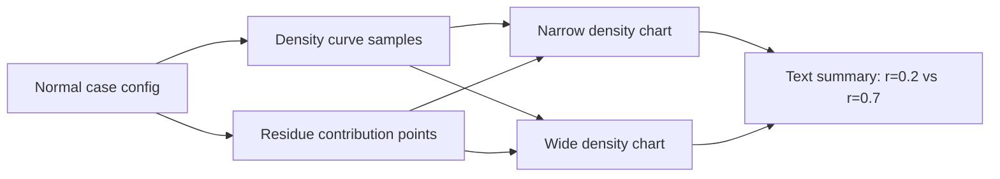

# feat: Improve Wrapped Normal Density Explanation

## Overview

Update the "Wrap the Normal around one order of magnitude" section so it teaches the load-bearing wrapped-density step with a real density visual instead of the current conceptual CSS illustration. The revised section should show that the wrapped density at a fractional position is a sum over integer shifts, and should contrast why `r = 0.2` and `r = 0.7` are very different for a narrow Normal but much closer for a wide Normal.

This is a targeted revision to the existing React/Vite app, not a new app or simulation redesign.

## Problem Frame

The current app correctly says a wide Normal can make fractional logs nearly uniform, but the visual explanation is too abstract: it does not show what is being summed. The updated requirements ask for a "deeper look" that makes the wrapped-density calculation concrete while keeping it subordinate to the main learning path (see origin: `docs/brainstorms/2026-05-09-benford-emergence-mini-app-requirements.md`).

## Requirements Trace

- R18. Show the wrapped density as a sum over integer shifts, with notation equivalent to `sum_{k in Integers} f_Z(k + r)` / `\sum_{k \in \mathbb{Z}} f_Z(k + r)`.
- R19. Contrast `Z ~ Normal(3.2, 0.1^2)` with `Z ~ Normal(3.2, 10^2)`.
- R20. Present the density plot as a "deeper look" rather than the main path.
- R21. Mark `r = 0.2` and `r = 0.7` contribution lines at shifted positions such as `..., 2.2, 3.2, 4.2, ...` and `..., 2.7, 3.7, 4.7, ...`.
- R22. Explain why the narrow sums differ and the wide sums are closer.
- R24. Keep the "wide enough" condition approximate, not a deterministic threshold.
- R46/R47. Preserve responsive readability and accessible chart/formula summaries.

## Scope Boundaries

- Do not change simulation behavior, controls, presets, diagnostics, or chart calculations in the Simulations tab.
- Do not add a third simulation mode or a high-SD constructed counterexample in this change.
- Do not convert all app notation from `log10` to `log`; keep this plan focused on the wrapped-density visual.
- Do not attempt a rigorous theorem proof; the visual should teach the intuition behind the integer-shift sum.

### Deferred to Separate Tasks

- Broader Simulation tab decisions from the origin document, including input bounds, rerun/seed behavior, and structured high-SD counterexamples.
- Whole-app notation cleanup, if desired later.

## Context & Research

### Relevant Code and Patterns

- `src/components/ExplainerPage.tsx` renders the "Why it Happens" tab and currently owns the wrapped-density copy and formula block.
- `src/components/WrappedNormalVisual.tsx` is currently a static two-panel CSS illustration with no data model.
- `src/styles/global.css` contains the `.wrap-visual` and `.curve` styles that should be replaced or extended for the new chart layout.
- `src/components/charts/ChartFrame.tsx`, `src/components/charts/BenfordPmfChart.tsx`, and `src/components/charts/FirstDigitChart.tsx` show the local Recharts pattern: `ChartFrame`, accessible summary text, `ResponsiveContainer`, and simple color semantics.
- `src/lib/random.ts` already has Normal sampling utilities, but the new visual should use analytic Normal density rather than random samples so the explanation is deterministic.

### Institutional Learnings

- No `docs/solutions/` directory is present in this repo, so there were no prior institutional solution docs to incorporate.

### External References

- External research is not needed. The repo already has the relevant React/Recharts/formula patterns, and the math source is local in `docs/Understanding Benford's Law.md`.

## Key Technical Decisions

- Use analytic density data, not sampled data: The visual explains a deterministic density sum. Sampling would introduce noise and distract from the intended comparison.
- Keep a dedicated wrapped-density component: `WrappedNormalVisual` already owns this section's visual; replacing its internals preserves the `ExplainerPage` boundary.
- Use Recharts for the density plots: The app already depends on Recharts and uses it for educational charts, so this follows local patterns without adding dependencies.
- Compute finite contribution windows around visible mass: The mathematical sum is infinite, but the visual can mark a finite set of shifted positions near the Normal's visible mass and state that negligible tails are omitted.
- Show both visual and textual sums: The chart should make the red contribution lines visible, while adjacent text or accessible summaries name the two residues and explain which sum is larger/closer.

## Open Questions

### Resolved During Planning

- Should the visual compare `r = 0.02` or `r = 0.2`? Use `r = 0.2` and `r = 0.7` because the narrow example is centered at `3.2`, so `r = 0.2` demonstrates the bunched case directly.
- Should the Normal parameters be written as variances or standard deviations? Use `Normal(3.2, 0.1^2)` and `Normal(3.2, 10^2)` in user-facing copy to remove ambiguity.
- Should the visual be mandatory in the main path? Treat it as a "deeper look" panel inside the section so the main narrative remains readable.

### Deferred to Implementation

- Exact chart dimensions and text wrapping can be tuned during browser verification, as long as desktop/mobile layouts remain readable and no formulas overflow.
- Exact contribution window can be adjusted for legibility, but it should stay centered on visible density mass and include enough shifted points to communicate summation.

## High-Level Technical Design

> This illustrates the intended approach and is directional guidance for review, not implementation specification. The implementing agent should treat it as context, not code to reproduce.

The component should derive two cases:

| Case | Mean | SD | Teaching point |
|------|------|----|----------------|
| Narrow | `3.2` | `0.1` | Most contribution mass lands near `r = 0.2`; `r = 0.7` is much smaller. |
| Wide | `3.2` | `10` | Many integer shifts contribute; the summed mass at `r = 0.2` and `r = 0.7` is closer. |

## Implementation Units

- [x] **Unit 1: Add Deterministic Normal Density Helpers**

**Goal:** Provide small, pure helpers for Normal density curve points and wrapped-density contribution summaries.

**Requirements:** R18, R19, R21, R22

**Dependencies:** None

**Files:**
- Create: `src/lib/wrappedNormal.ts`
- Create: `src/lib/wrappedNormal.test.ts`

**Approach:**
- Add a pure `normalDensity` helper for finite numbers, mean, and positive standard deviation.
- Add a helper that returns contribution points for a residue `r` over a bounded integer-shift window.
- Add a helper that sums those contribution densities for `r = 0.2` and `r = 0.7` for the narrow and wide examples.
- Keep these helpers presentation-agnostic so `WrappedNormalVisual` only renders prepared data.

**Execution note:** Implement the helper behavior test-first.

**Patterns to follow:**
- `src/lib/benford.ts` for small pure math helpers with validation.
- `src/lib/benford.test.ts` and `src/lib/histograms.test.ts` for numeric expectations using approximate comparisons.

**Test scenarios:**
- Happy path: `normalDensity(3.2, 3.2, 0.1)` is greater than `normalDensity(3.7, 3.2, 0.1)`.
- Happy path: narrow wrapped sum at `r = 0.2` is much greater than narrow wrapped sum at `r = 0.7`.
- Happy path: wide wrapped sums at `r = 0.2` and `r = 0.7` are closer to each other than the narrow sums.
- Edge case: helper rejects or safely handles non-positive standard deviation.
- Edge case: contribution helper only returns integer-shift positions and preserves the residue in each `k + r` value.

**Verification:**
- Helper tests prove the narrow-vs-wide comparison without rendering React.

- [x] **Unit 2: Replace WrappedNormalVisual With Data-Backed Density Charts**

**Goal:** Replace the static conceptual visual with a side-by-side Recharts visualization showing narrow and wide Normal density curves plus red contribution lines for `r = 0.2` and `r = 0.7`.

**Requirements:** R18, R19, R20, R21, R22, R46

**Dependencies:** Unit 1

**Files:**
- Modify: `src/components/WrappedNormalVisual.tsx`
- Create: `src/components/WrappedNormalVisual.test.tsx`
- Modify: `src/styles/global.css`

**Approach:**
- Keep the existing `WrappedNormalVisual` component name and import path.
- Render two panels: "Narrow Normal" and "Wide Normal".
- Use local Recharts patterns with responsive containers, accessible summaries, and stable labels.
- Mark contribution positions using red vertical markers or equivalent chart references; use distinct labels for `r = 0.2` and `r = 0.7` without relying on color alone.
- Include text under each panel that names the qualitative result: narrow sums differ; wide sums are closer.
- Keep the visual labelled as a "deeper look" so the section does not read like a proof-first detour.

**Execution note:** Start with a component test that fails on the missing residues, labels, and accessible summary.

**Patterns to follow:**
- `src/components/charts/ChartFrame.tsx`
- `src/components/charts/BenfordPmfChart.tsx`
- `src/components/charts/FirstDigitChart.tsx`
- Existing `.wrap-visual` responsive behavior in `src/styles/global.css`

**Test scenarios:**
- Happy path: renders "Narrow Normal" and "Wide Normal" panels.
- Happy path: renders labels for `Normal(3.2, 0.1^2)` and `Normal(3.2, 10^2)`.
- Happy path: exposes accessible text that the red lines are integer-shift contributions for `r = 0.2` and `r = 0.7`.
- Happy path: exposes text that the narrow sums differ and the wide sums are closer.
- Edge case: chart summary remains available to screen readers even if SVG internals are not meaningful.

**Verification:**
- Component tests cover the visible teaching labels and accessible summaries.
- Browser visual check confirms both panels are readable and not clipped.

- [x] **Unit 3: Update Explainer Copy and Wrapped-Density Formula**

**Goal:** Align the surrounding section copy and formula with the updated integer-shift explanation and "deeper look" framing.

**Requirements:** R18, R19, R20, R21, R22, R24, R47

**Dependencies:** Unit 1 can be parallel; Unit 2 should land before final copy tuning if chart wording needs alignment.

**Files:**
- Modify: `src/components/ExplainerPage.tsx`
- Modify: `src/components/ExplainerPage.test.tsx`

**Approach:**
- Change the wrapped-density formula to use integer-set notation: `\sum_{k \in \mathbb{Z}} f_Z(k+r)`.
- Add or adjust prose to say the sum is over all integers `k`.
- Update Normal examples to `Normal(3.2, 0.1^2)` and `Normal(3.2, 10^2)`.
- Explain that the chart compares `r = 0.2` and `r = 0.7`, and that finite plots omit negligible tails.
- Preserve the existing caveat that wide Normal behavior is approximate and finite samples can still deviate.

**Execution note:** Update the explainer test first so it fails on the old formula/copy.

**Patterns to follow:**
- Existing `FormulaBlock` usage in `src/components/ExplainerPage.tsx`.
- Existing tests in `src/components/ExplainerPage.test.tsx` that assert key learner-facing text.

**Test scenarios:**
- Happy path: explainer renders a wrapped-density formula labelled "Wrapped density" with integer-shift wording.
- Happy path: explainer text says the sum is over integers.
- Happy path: explainer includes `Normal(3.2, 0.1^2)` and `Normal(3.2, 10^2)` or accessible equivalent wording.
- Happy path: explainer includes `r = 0.2` and `r = 0.7`.
- Regression: explainer no longer uses ambiguous `N(3.2, 0.01)` / `N(3.2, 100)` wording.

**Verification:**
- Explainer tests pass and the rendered copy matches the origin requirements.

- [x] **Unit 4: Responsive Visual QA and Polish**

**Goal:** Ensure the new density visual works in the actual app layout across desktop and mobile.

**Requirements:** R20, R21, R22, R46, success criteria for the wrapped-density deeper look

**Dependencies:** Units 2 and 3

**Files:**
- Modify: `src/styles/global.css`
- Test: `src/components/WrappedNormalVisual.test.tsx`

**Approach:**
- Tune `.wrap-visual` and related chart styles so panels stack cleanly on mobile and remain side-by-side on desktop.
- Ensure chart labels do not overlap or overflow at narrow widths.
- Keep colors consistent with the app palette while making contribution markers prominent enough to support the explanation.
- Confirm the chart has text summaries so color is not the only encoding.

**Patterns to follow:**
- Existing responsive media query in `src/styles/global.css`.
- Existing chart containers and summaries in `src/components/charts/`.

**Test scenarios:**
- Test expectation: no separate unit test for pixel-perfect styling; component tests from Unit 2 cover semantic rendering. Use browser verification for actual layout.

**Verification:**
- Full test suite passes.
- Production build passes.
- Browser visual check on desktop and mobile shows no horizontal overflow, clipped formulas, or unreadable chart labels.

## System-Wide Impact

- **Interaction graph:** This change affects the static "Why it Happens" tab only. App navigation, simulations, diagnostics, and chart data flows remain unchanged.
- **Error propagation:** Pure density helpers should validate invalid standard deviations before chart rendering. No async or external failure paths are introduced.
- **State lifecycle risks:** None. The visual is deterministic and stateless.
- **API surface parity:** No public API or route changes. If helper exports are added in `src/lib/wrappedNormal.ts`, they are internal app utilities.
- **Integration coverage:** Component tests plus browser visual checks are sufficient because the change is static rendering plus pure math helpers.
- **Unchanged invariants:** Simulation outputs, Benford probability helpers, tab labels, and existing first-digit charts should not change.

## Risks & Dependencies

| Risk | Mitigation |
|------|------------|
| The deeper look becomes too visually dense | Keep it inside the existing section as a labelled deeper look, with one simple comparison: `r = 0.2` versus `r = 0.7`. |
| Infinite sum is misrepresented by finite plotted points | Use formula/prose for the infinite integer sum and label the plotted window as visible contributions with negligible tails omitted. |
| Recharts reference markers become hard to read on mobile | Use responsive stacking, concise labels, and browser verification at mobile width. |
| The chart implies sampled simulation behavior | Use analytic density helpers and copy that describes density, not random samples. |

## Documentation / Operational Notes

- No README or deployment changes are required.
- The requirements document has already been updated; this plan should be the execution handoff for the wrapped-density visual revision.

## Sources & References

- Origin document: `docs/brainstorms/2026-05-09-benford-emergence-mini-app-requirements.md`
- Math source: `docs/Understanding Benford's Law.md`
- Existing visual component: `src/components/WrappedNormalVisual.tsx`
- Explainer page: `src/components/ExplainerPage.tsx`
- Chart pattern: `src/components/charts/ChartFrame.tsx`
